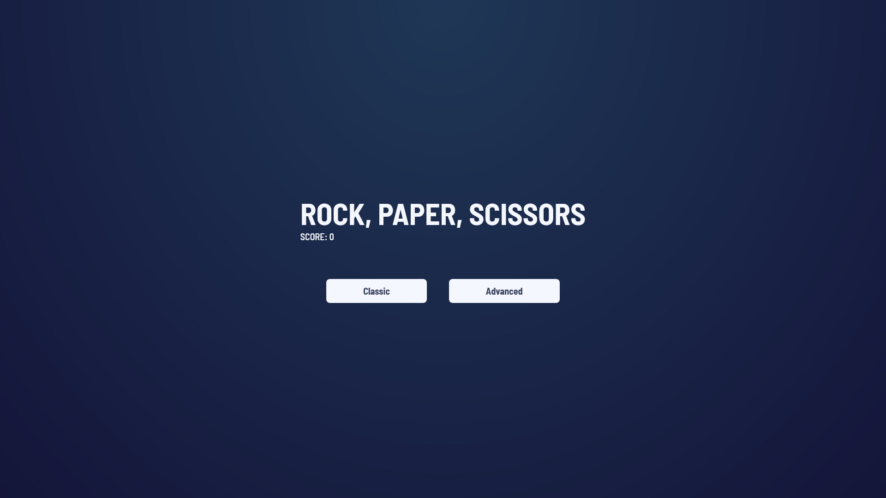
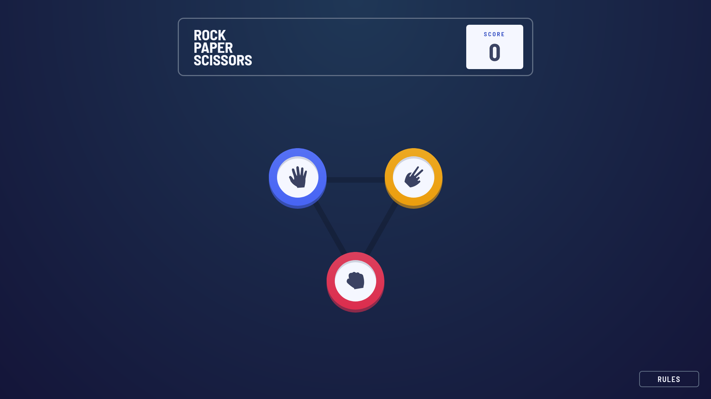
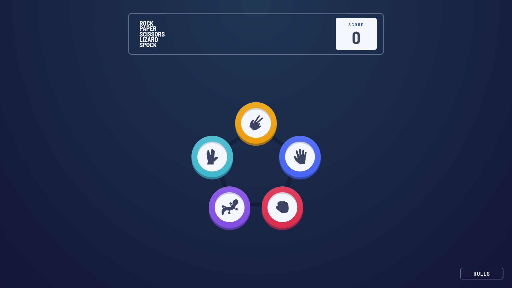
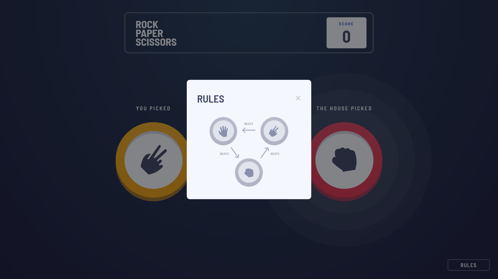
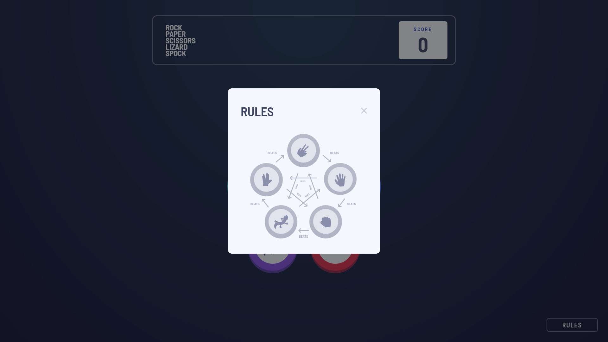
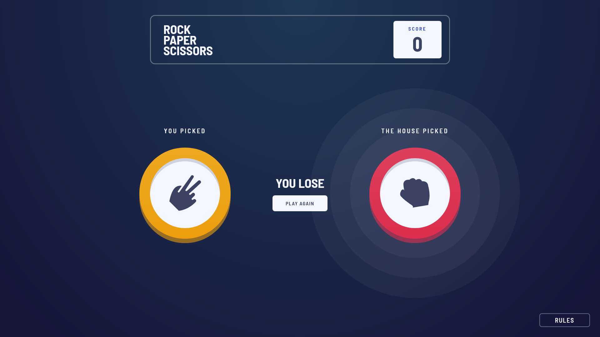

# Frontend Mentor - Rock, Paper, Scissors solution

This is a solution to the [Rock, Paper, Scissors challenge on Frontend Mentor](https://www.frontendmentor.io/challenges/rock-paper-scissors-game-pTgwgvgH). Frontend Mentor challenges help you improve your coding skills by building realistic projects.

## Table of contents

- [Overview](#overview)
	- [The challenge](#the-challenge)
	- [Screenshot](#screenshot)
- [My process](#my-process)
	- [Built with](#built-with)
- [Author](#author)

**Note: Delete this note and update the table of contents based on what sections you keep.**

## Overview

### The challenge

Users should be able to:

- View the optimal layout for the game depending on their device's screen size
- Play Rock, Paper, Scissors against the computer
- Maintain the state of the score after refreshing the browser
- **Bonus**: Play Rock, Paper, Scissors, Lizard, Spock against the computer

### Screenshot

Home page - Selection mode

Classic game view

Advanced game view

Classic Game - Rule display

Advanced Game - Rule display

Result Display

### Links

- Solution URL: [GitHub Code Preview](https://github.com/loicmaes/paper-rock-scissors)
- Live Site URL: [Play to the game ^^](https://rps.maesloic.fr/)

## My process

### Built with

- [Vue.JS](https://vuejs.org/)
- [SASS](https://sass-lang.com/) - CSS Preprocessor
- Flexbox
- Desktop App only

## Author

- Website - [Loïc MAES](https://maesloic.fr/)
- Frontend Mentor - [@loicmaes](https://www.frontendmentor.io/profile/loicmaes)
- Twitter - [@LoicServices](https://www.twitter.com/LoicServices)
- Instagram - [@loicmaes.services](https://www.instagram.com/loicmaes.services)
- ✉ Email - [contact@services.maesloic.fr](mailto:contact@services.maesloic.fr)
- 📞 Phone - [+33 (0)3 88 31 53 86](tel:+33388315386)
